# Metrics

OpenVector turns CSV files into team-level engineering metrics. All formulas live in `src/metrics/`. Dashboard pages only render API results; they never recalculate business metrics.

Use this page to learn **what each number is**, **where it appears**, and **how to infer** whether the signal is healthy, mixed, or a problem. Images are the individual cards and charts from the sample files in `/data` (Acme / Payments / Checkout and Acme / Travel / Booking).

Decimals on the dashboard are rounded to two places. Whole numbers stay whole. Missing source data is shown as an em dash (`—`) and is omitted from weighted scores — OpenVector does not invent values.

## How to read the dashboard

Filters at the top (organization → vertical → product → team) apply to every page. Coverage and SonarQube quality are keyed by **module**, not team, so a team filter still shows product/module rows that match the rest of the hierarchy.

**Trend arrows** appear only when a previous comparable value exists:

| Arrow | Meaning |
|---|---|
| Improving | Change is more than 5% in the desired direction |
| Stable | Change is inside ±5% |
| Declining | Change is more than 5% in the undesired direction |

Desired direction: higher is better for velocity, SP / capacity day, and maturity. Lower is better for defect leakage.

Charts show data labels on bars and lines by default. Use **Hide data labels** / **Show data labels** on a chart if the plot is crowded. Use **Download PNG** to save the plot. Click a bar, point, or KPI to drill down. Click a breadcrumb to go back.

---

## Overview

The Overview page is the executive summary. Each card links to the page that owns the metric.

### Quality Maturity

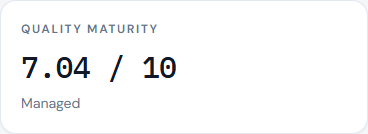

**What it is.** A 0–10 weighted score of automation coverage, code coverage, SonarQube code quality, and defect leakage. The band (World Class, Optimized, Managed, Developing, Initial, Critical) is the first matching minimum in `openvector.yaml`.

**How to infer it.** Treat the band as the headline, then open Maturity to see which component is holding the score down. A “Managed” 7.0 with strong coverage but high leakage means quality process, not test volume, is the constraint. A missing component is dropped from the average — do not read a high score as “everything is measured.”

### Velocity

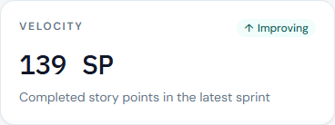

**What it is.** Completed story points in the latest sprint (all teams in the current filter, summed).

**How to infer it.** Look at the arrow first: improving means the latest sprint completed more points than the one before, beyond the 5% band. Then open Productivity and compare planned vs completed. Rising velocity with falling SP / capacity day usually means more people or more days, not more output per day.

### SP / Capacity Day

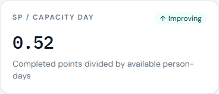

**What it is.** Completed story points ÷ available person-days in the latest sprint. This is **not** story points per developer.

**How to infer it.** Use this when you want delivery rate independent of team size and holidays. A stable velocity with a declining SP / capacity day often means capacity grew faster than output (leave, holidays, or a larger team). The reverse — fewer points but a higher rate — can be a smaller sprint or a holiday-heavy calendar, not a productivity collapse.

### Defect Leakage

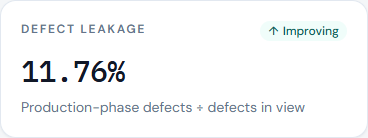

**What it is.** Production-phase defects ÷ defects in the current view × 100. Production is any `detection_phase` listed under `productionPhases` (default: Production). On Overview the view is every defect that matches the org filters (all releases).

**How to infer it.** Lower is better. Near 0% means almost nothing in view reached production. A double-digit rate means a meaningful share escaped earlier phases. Click the card to open Quality filtered to production defects. Prefer the per-release DRE line on Quality for escape rate; the Overview number mixes every release in the filter. Compare leakage to DRE on the same set (`DRE + leakage ≈ 100%`).

### Open Defects

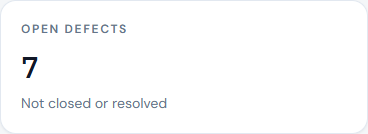

**What it is.** Count of defects whose status is not in `closedStatuses` (default Closed, Resolved, Done).

**How to infer it.** This is a stock, not a rate. A high count with a falling daily open-backlog line means the team is working the pile down. A low count that is still rising day over day is an inflow problem. Click through to the defect list and check age and severity before treating the number as a crisis.

### Customer Defects

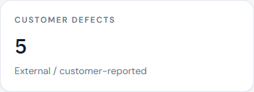

**What it is.** Count of defects with `customer_reported = true` (external). All others are internal.

**How to infer it.** Customer-found defects are a user-visible quality signal. A few Sev1 customer defects matter more than many internal Sev4s. Use this with leakage: customer + production is the worst combination.

---

## Productivity

### Available capacity (person-days)

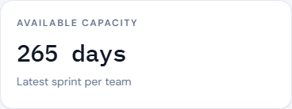

```text
Gross capacity      = team size × working days
Holiday capacity    = team size × holiday days
Available capacity  = gross − holiday capacity − leave days
```

Example: 10 people, 10 working days, 1 holiday, 2 leave days → `100 − 10 − 2 = 88`.

`leave_days` is total person-days of leave in the sprint, not days per person.

**How to infer it.** Read capacity next to completed points, not alone. A drop in capacity explains a drop in velocity. If capacity is flat and completed points fall, the issue is delivery, not calendar.

### Velocity

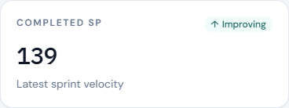

```text
Velocity = completed story points
```

**How to infer it.** One sprint is noise. Use the moving-average line on the chart. A single sprint above plan with a flat average is a spike. Several sprints below plan with a falling average is a trend.

### Story points per capacity day

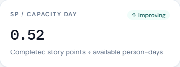

```text
SP / capacity day = completed story points ÷ available person-days
```

**How to infer it.** This is the fairest comparison across teams of different sizes. If Team A completes 40 points on 80 person-days (0.50) and Team B completes 60 on 200 (0.30), B is not “more productive.” Watch the right-hand axis on the merged chart: a falling red line while green completed bars stay high means you bought the extra points with extra capacity.

### Moving average

Trailing average of completed story points over `metrics.velocityMovingAverage` sprints (default 6). If fewer sprints exist, every available sprint is used. Values are never padded.

**How to infer it.** The dashed line is the trend you should manage to. Ignore a one-sprint miss if the average is still rising. Act when the average turns down across two or more sprints.

### Velocity · Planned vs Completed chart

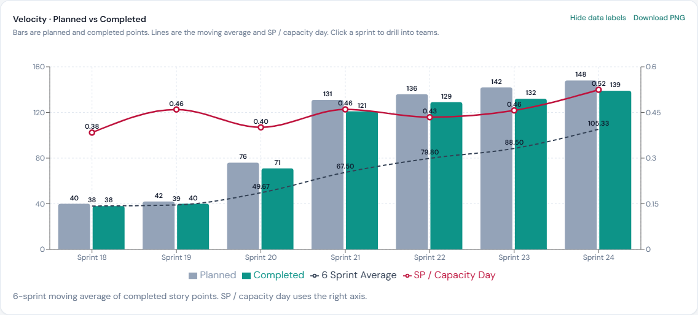

Gray bars are planned points, teal bars are completed, the dashed line is the moving average, and the red line (right axis) is SP / capacity day.

**How to infer it.**

- Completed near planned, stable SP / capacity day: predictable delivery.
- Completed well below planned for several sprints: planning is optimistic, or interruptions are chronic.
- Completed above planned with a falling SP / capacity day: more people or more days, not a tighter process.
- Click a sprint to see the same layout by team. Click a team bar to set the organization filters.

---

## Quality

No release is selected by default, so charts use the full defect set. Click a release on the phase/DRE chart to filter. Click **All releases** to clear.

### Defect leakage

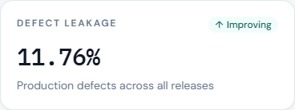

```text
Defect leakage = production-phase defects ÷ defects in the current view × 100
```

If there are no defects, leakage is omitted. With no release selected, the view is every matching defect. Click a release to measure that `found_in_release` only.

**How to infer it.** Compare releases on the phase/DRE chart, not only the KPI. Leakage that stays high while Production bars stay tall means escapes are structural (missing tests, weak UAT), not a one-off. Leakage that drops while total defects stay similar means earlier phases are catching more.

### Defect removal efficiency

```text
DRE = defects found before production ÷ total defects in the release × 100
```

This is the complement of leakage for that release. Phases are Development, System Testing, UAT, and Production (aliases such as Unit Testing → Development are in `openvector.yaml`).

**How to infer it.** Read the black DRE line against the stacked phase bars.

- High DRE, most bars in Development / System Testing: defects are found early. Healthy.
- High DRE but a large UAT bar: testers are catching what development missed. The score looks fine; the cost is late.
- Low DRE and a large Production bar: customers or production monitoring are your test suite.

### Defects by Phase and DRE by Release

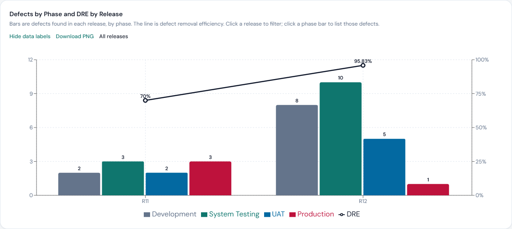

Grouped bars are defects found in each `found_in_release`, by detection phase. The line is DRE for that release.

**How to infer it.** Scan left to right. A release that grows Production (red) while DRE falls is a regression in removal efficiency. Click a phase bar to list those defects. Click the release to filter the rest of the page.

### Open / Closure Daily Trend

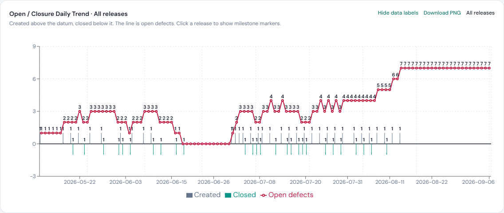

Created counts sit above the zero line, closed counts below it, and the red line is remaining open defects. Dates use `created_date` and `resolved_date`.

When a release is selected, `release-plan.csv` milestones (Dev Start, Dev Complete, Test Start, Test Complete, Prod Deployment) appear as vertical markers. Use **Hide milestones** / **Show milestones** if the labels overlap. The series is extended so milestone dates land on the axis.

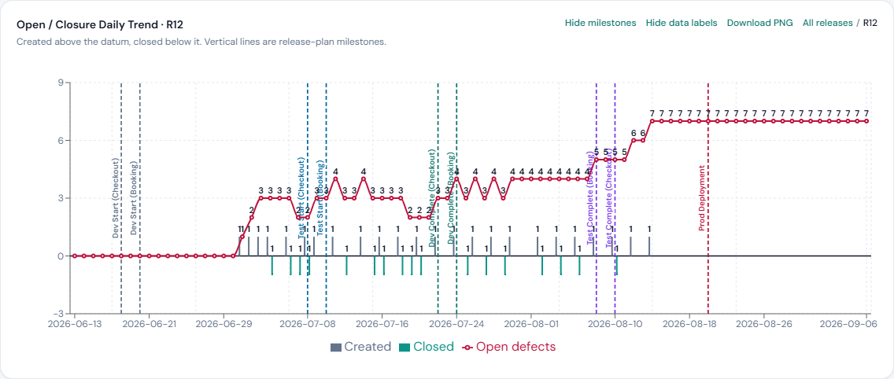

**How to infer it.**

- Open-backlog line rising: inflow exceeds outflow. Look at created bars.
- Line falling: the team is closing faster than new defects arrive.
- A spike of created bars after **Test Start** is expected. A spike after **Prod Deployment** is leakage in time.
- Created bars during Dev Start–Dev Complete that are Production phase are a data-quality smell (phase and dates disagree).
- If Checkout and Booking use different dates for the same milestone, both lines are shown and labeled.

### Defects by Status and Severity

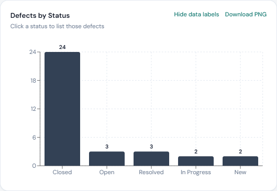 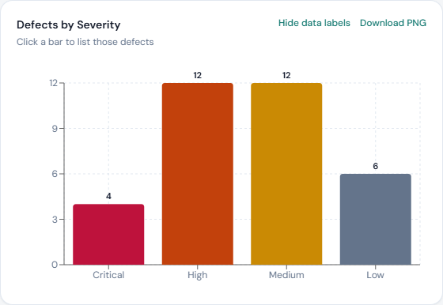

**Status.** Raw `status` values as stored in the CSV (New, Open, In Progress, Closed, and so on).

**How to infer it.** A large “In Progress” pile with few Closed in the daily trend means work is stuck, not that inflow is high. Click a status to list those rows.

**Severity.** CSV severities are mapped through `severity` in `openvector.yaml` (for example Sev1 → Critical, Sev2 → High). Unmapped values appear as Unmapped.

**How to infer it.** Weight Critical/High over Medium/Low. Nine Medium defects are not worse than two Critical ones. Click a bar, then check whether those defects are customer-reported or production.

### Defects by Age and Internally Found vs Customer Found

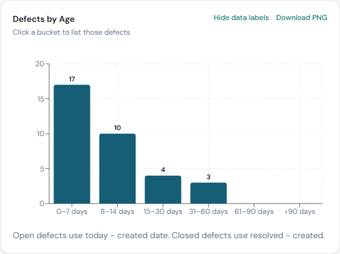 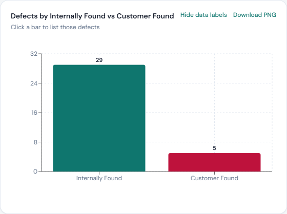

**Age.**

- Open: today − `created_date`
- Closed: `resolved_date` − `created_date`

Buckets: 0–7, 8–14, 15–30, 31–60, 61–90, >90 days.

**How to infer it.** Age of **open** defects is the one that matters for risk. A tall >90 bar of still-open High/Critical items is a backlog that will not age out on its own. Closed defects in >90 tell you historical cycle time, not current danger.

**Internally Found vs Customer Found.** `customer_reported = true` is Customer Found. Otherwise Internally Found. The Customer Defects KPI is the customer-found count.

**How to infer it.** Internal-heavy and early-phase is a working quality process. Customer-heavy, especially in Production, is escaped customer pain. Click a bar to list those defects.

---

## Maturity

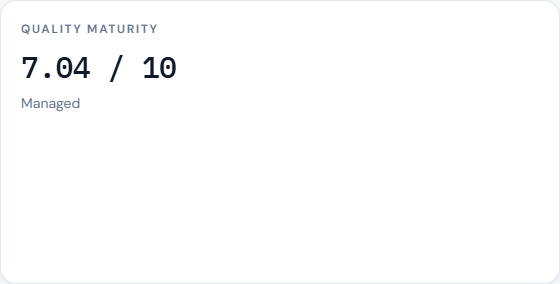

Each component has a raw value, a 0–10 score, and a weight. Overall maturity is the weighted average of components that have data.

| Metric | Raw value | Score (0–10) |
|---|---|---|
| Automation coverage | Latest percent per team, then averaged | percent / 10 |
| Code coverage | Covered ÷ coverable × 100, latest row per module, then summed | percent / 10 |
| Code quality | Weighted SonarQube score (0–10) | same value |
| Defect leakage | Same percent as Overview / Quality with no release selected | `10 × (1 − leakage / leakageZeroScoreAt)` |

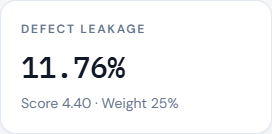

Default `leakageZeroScoreAt` is 21: 0% leakage scores 10, 21% scores 0. Default component weights are 25% each.

```text
Overall = Σ (score × weight) / Σ weights of available components
```

Missing inputs are dropped. They are not replaced with zeros.

Bands (first matching minimum):

| Score | Band | How to infer it |
|---|---|---|
| 9–10 | World Class | All four inputs are strong. Confirm nothing important is missing from the average. |
| 8–8.9 | Optimized | Solid. Look at the weakest component for the next increment. |
| 7–7.9 | Managed | Process exists but one or two inputs are dragging (often leakage or coverage). |
| 5–6.9 | Developing | Mixed practice. Drill the lowest score; do not chase the overall number. |
| 3–4.9 | Initial | Basic measurement only. Expect large gaps in automation, coverage, or escapes. |
| 0–2.9 | Critical | Systemic quality risk. Treat leakage and production defects first. |
| — | Unavailable | No source data for any component. |

**How to infer the overall score.** Click a component card or the Normalized Scores bar to see the latest value per team (automation, leakage) or module (coverage, quality). The overall number cannot be higher than a weak, heavily weighted component. If leakage is 12% (score ≈ 4.3) and the other three are 8+, overall stays in Managed even when engineering looks “green.”

### Automation coverage

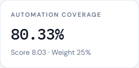

Latest `automation_coverage` per team, then averaged. Score = percent / 10.

**How to infer it.** This is test automation share, not code coverage. A high automation score with low code coverage means many automated tests on a thin slice of the code. The reverse means unit coverage without broader automation.

### Code coverage

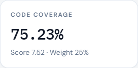

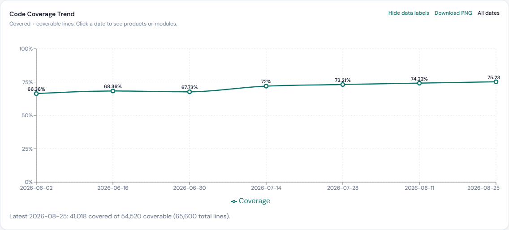

```text
Coverage = covered lines ÷ coverable lines × 100
```

Latest snapshot: newest row per module, then **sum** `covered_lines` and `coverable_lines` before dividing. That avoids averaging percentages of unequal modules.

The Code Coverage Trend chart plots that percent over time. Click a date to see products (if more than one) or modules. Click a module to see that module’s history.

**How to infer it.**

- A rising line with growing coverable lines is real improvement.
- A rising line with shrinking coverable lines can be deleted untested code, not better tests.
- Drill to modules: one poorly covered payments-core can hide inside a healthy product average if you only look at the percent.

### Code quality (SonarQube)

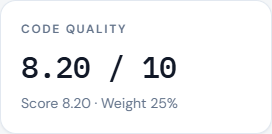

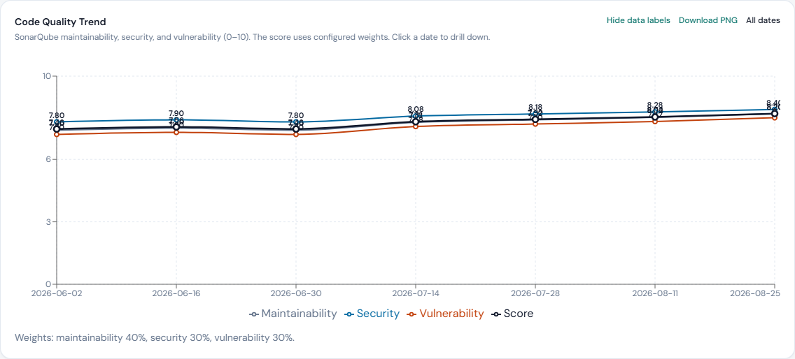

```text
Score = (maintainability × w_m + security × w_s + vulnerability × w_v)
        / (w_m + w_s + w_v)
```

Default weights in `openvector.yaml` under `codeQuality.weights`: maintainability 40%, security 30%, vulnerability 30%. Each rating is 0–10 (higher is better).

Latest snapshot: newest row per module, then average of those module scores. That score is the Code Quality input to overall maturity.

The Code Quality Trend chart shows the three ratings plus the weighted score. Click a date to drill product → module.

**How to infer it.**

- Score rising while one rating is flat: the weights are lifting the others. Check the weak rating explicitly.
- Security or vulnerability falling while maintainability rises: the overall score can still look fine. Do not manage only the black score line.
- Compare modules on a date: a single module below 7 is the place to act, not a 0.2 movement in the org average.

### Normalized Scores chart

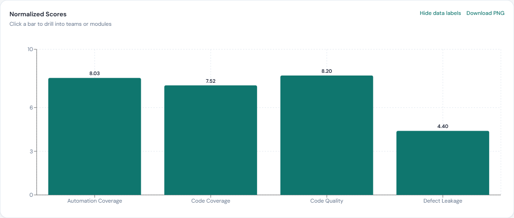

Bars are the 0–10 scores used in the overall average. Click a bar for the latest team or module breakdown.

**How to infer it.** The shortest bar is the constraint. Improving an already-high component barely moves overall if leakage is the short bar.

---

## Trends

Arrows use the previous comparable value only. No previous value means no arrow.

- Velocity and SP / capacity day: latest sprint vs the sprint before it
- Defect leakage: current view vs the previous release in that view. On Overview (all releases) the current value is the portfolio rate, so prefer the Quality phase/DRE chart for release-to-release change.
- Maturity: shown when a previous overall score is available

A change inside ±5% is **stable**, even if the raw number ticked up or down.

**How to infer it.** Do not treat Stable as “no work needed.” A stable 12% leakage is a stable problem. Use the arrow for direction, the raw value for whether the level is acceptable.

---

## What OpenVector does not measure

- Individual output (commits, lines of code, hours)
- Story points per developer
- Forecasts or invented values when a CSV is missing

If a file is absent (`automation.csv`, `code-coverage.csv`, `code-quality.csv`, `release-plan.csv`), related cards and charts are omitted or unmarked. See [data-format.md](data-format.md) for columns and [openvector.yaml](../openvector.yaml) for weights, phases, and severity aliases.
